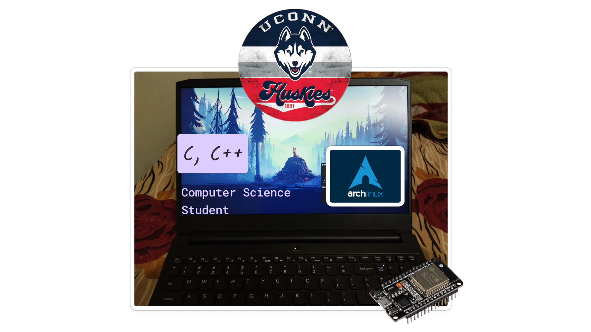

Hi there! 

I'm Sai Kiran Belana 👋. I'm currently pursuing a Master's degree at the University of Connecticut 🎓. 

- My passions include Operating Systems, Computer Security, and Embedded Systems  💻. 
- When I'm not coding, you can find me playing CS:GO 🎮. 
- In my free time, I do street photography 📸.

## About Me

- 🔭 Apart from my School projects, I'm currenlty learning RTOS and Embedded Sytems in free time.
- 🌟 Fun fact: I follow a polyphasic sleep schedule, sleeping for 4 hours every 12 hours
- Check out my photography on Unsplash  

- Also Looking for Summer Internships and FALL CO-OP programs

Let's connect and build something amazing together!

You can also find me Here ↵

 

Technologies and Tools I use: 

<a href="https://belanasaikiran.github.io" target="blank" > Portfolio Website </a> 

